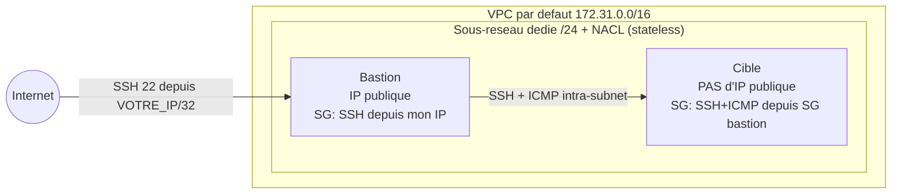

# Compte rendu — TD Jour 1 : Sécurité réseau AWS

**Auteur :** Quentin Kail
**Région :** eu-west-3 · **Compte partagé :** 747082607185
**Outil :** Terraform (IaC), VPC par défaut, EC2, Security Groups, NACL

## Schéma logique

L'isolation se fait **sans sous-réseau privé** : la cible n'a tout simplement pas
d'IP publique, donc elle est injoignable d'Internet et accessible uniquement via
le bastion. Deux couches de filtrage : la **NACL** (sous-réseau) puis le
**Security Group** (instance).

## Réponses aux questions

### Partie 1 — Explorer le VPC par défaut
1. La plage du VPC par défaut est **172.31.0.0/16**. Ses sous-réseaux sont dits
   « publics » car leur table de routage envoie **0.0.0.0/0 vers l'Internet
   Gateway** : toute instance y ayant une IP publique est joignable d'Internet.
2. Sans sous-réseau privé, on rend une instance injoignable en **ne lui attribuant
   pas d'IP publique** (`associate_public_ip_address = false`) : elle n'a alors
   aucune adresse routable depuis Internet.

### Partie 2 — Lancer deux instances
1. Le **bastion** (avec IP publique) est joignable d'Internet ; la **cible** ne
   l'est pas, car elle n'a pas d'IP publique malgré un sous-réseau public.
2. On atteint la cible en **rebondissant par le bastion** (SSH ProxyJump `-J`, ou
   en copiant la clé sur le bastion), via son **IP privée** 172.31.x.x.

### Partie 3 — Security Groups (stateful)
1. On met la source de `sg-cible` = **le groupe `sg-bastion`** plutôt qu'une plage
   d'IP, car l'IP privée du bastion peut changer (recréation) : la référence de
   groupe suit automatiquement, exprime l'intention « depuis le bastion » et reste
   valable quelle que soit l'instance attachée au groupe.
2. La réponse repart sans règle de sortie explicite car un Security Group est
   **stateful** : il mémorise la connexion entrante autorisée et laisse passer
   automatiquement le trafic retour.

### Partie 4 — NACL (stateless)
1. La connexion arrive sur le port 22, mais la **réponse du serveur part vers un
   port éphémère** côté client (1024–65535). La NACL étant **stateless**, il faut
   autoriser explicitement la **sortie sur 1024–65535**, pas sur le port 22.
2. **SG** : stateful, au niveau instance, règles *allow* seulement, retour
   automatique. **NACL** : stateless, au niveau sous-réseau, règles *allow* **et**
   *deny* numérotées, retour à autoriser explicitement.

### Partie 5 — Défense en profondeur
1. **Non**, le trafic ne passe pas : la NACL est évaluée au niveau du sous-réseau,
   **avant** le SG. Un *deny* NACL bloque le paquet avant qu'il n'atteigne
   l'instance, donc le SG n'a jamais l'occasion de l'autoriser. Le plus restrictif
   l'emporte.
2. Avantage concret de deux couches : si l'une est mal configurée (ex. un SG
   ouvert par erreur), l'autre (NACL) peut encore bloquer. On réduit la surface
   d'erreur et d'attaque — c'est la **défense en profondeur**.

## Bonnes pratiques retenues
- SSH (22) **jamais** en `0.0.0.0/0` : restreint à `VOTRE_IP/32`.
- Source d'un SG = **un autre SG** plutôt qu'une plage d'IP quand c'est possible.
- Isolation par **absence d'IP publique** + accès via bastion.
- Penser au **trafic retour** sur les NACL (stateless), inutile sur les SG (stateful).
- **Défense en profondeur** : NACL (sous-réseau) + SG (instance).
- IaC reproductible (Terraform), **destroy** en fin de TP, et **ne jamais
  committer** clés privées, `*.tfstate` ni `*.tfvars`.
